# Hi there 👋

## Who am I 🤔 ？

~~The Master of Nothing~~

A simple college student, major in Artificial Intelligence.

Love **Touhou Project☯** and doing some awful Graphic Designs.

The Programming Language I used/am using: 

 - Python(A great and flexible script language)
 - Java(Just want to make some mcmod)
 - Rust(Interesting and Modern, also Safe and Fast)
 - Dart(Flutter is easy to make some beautiful cross-platform application)

## Skills 😎

## Status 📊

## Contact 📞

- Github: https://github.com/H2Sxxa
- Email : mailto:h2sxxa0w0@gmail.com
- Steam : 1227101305
- BiliBili : https://space.bilibili.com/393570351

## Others 💡

- A Minecraft Touhou Mod QQ-Group: 752204159
- Blog: https://h2sxxa.github.io
